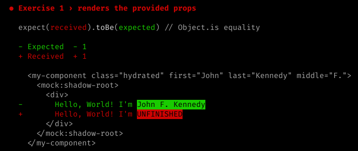

# Exercise 1

This exercise is about simply using a prop on an already-provided Web Component. For this exercise we will be using `<my-component>` as our Web Component.

## 1. In your console

Since this is the first thing we are doing, make sure you followed the [Setup instructions](../readme.md#setup) in the root `readme`.

Once your environment is set up you may continue.

### Setting expectations

Most of the exercises have accompanying automated tests which start out as failing. Once we are finished with the exercise, the tests should pass. To let us know what we are trying to accomplish, run the tests and quickly glance at the output:

```bash
yarn test
```

You should see this in your output:



### Run command

We need to start up a simple development server where we can see the Web Components in use:

```bash
yarn start
```

## 2. In your browser

The dev server should have already opened a tab for you at [http://localhost:3333](http://localhost:3333). If not, navigate there now.

Notice the "**Hello, World! I'm UNFINISHED**" text.

## 3. In your editor

The `<my-component>` Web Component has `first`, `middle`, and `last` as available props on it.

1. Open `src/index.html`
1. Find the `<my-component>` node and add a prop to it, such as `first="John"`.
1. Save and wait for the server to recompile your changes


## 4. In your browser

1. See that `UNFINISHED` still appears, and the value you entered as a prop does not.
  - You can also use the DOM inspector and verify that the prop appears on the node as an attribute

## 5. In your editor

1. Open `src/components/my-component/my-component.tsx`
1. Change the code so that the value of your prop is rendered instead of `UNFINISHED`

## Wrapping up

After finishing the previous step, the file should be updated in your browser so that your prop is visible on the page (along with an extra surprise). Just to be sure, run the following command to make sure that our changes have gotten the tests to pass:

```bash
yarn test
```
