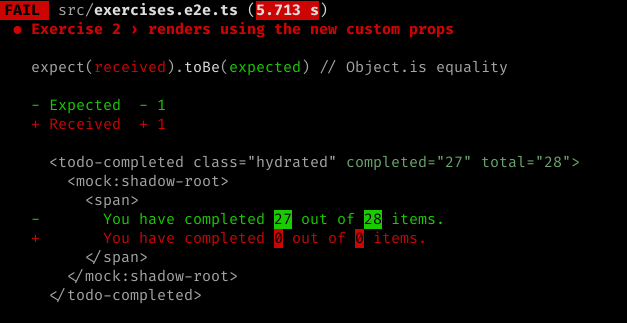

# Exercise 2

This exercise will focus on adding a prop to a Web Component.

## 1. In your console

### Branch checkout

We will be using the branch `ex-2`:

```bash
git checkout -f ex-2
```

### Setting expectations

```bash
yarn test
```

#### Output



### Run command

If your server isn't already started, start it.

```bash
yarn start
```

## 2. In your browser

The dev server should have already opened a tab for you at [http://localhost:3333](http://localhost:3333). If not, navigate there now.

Notice the "**You have completed 0 out of 0 items.**" text. We would like this message to reflect the actual props that are being passed into the `<todo-completed>` component.

## 3. In your editor

1. Open `src/index.html`
1. Find the `<todo-completed>` node and see that it already has the `todo` and `completed` props on the node.

We're already passing props to the component, but similar to Exercise 1, it's not making use of them. We'll have to modify the component definition to change that.

1. Open `src/components/todo-completed/todo-completed.tsx`
1. We can see where the hard-coding is coming from:
  ```jsx
    render() {
      const { completed, total } = { completed: 0, total: 0};
      return (
        <Host>
          <span>You have completed {completed} out of {total} items.</span>
        </Host>
      );
  ```

To correct this problem, we must do three things:
1. Import `Prop` from `@stencil/core`
1. Use the `@Prop()` decorator in the component definition
1. Destructure the `completed` and `total` consts from `this` instead of a hard-coded Object

## Wrapping up

Once your changes are compiled and the page is refreshed, you should see the props reflected in the rendered markup! Let's double-check that we're finished by seeing if the tests pass:

```bash
yarn test
```

