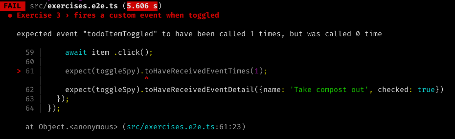

# Exercise 3

This exercise will involve firing a CustomEvent. This isn't specific to Web Components, but is [an API that is already a part of modern browsers](https://developer.mozilla.org/en-US/docs/Web/API/CustomEvent/CustomEvent). We start off with a `<todo-item>` Web Component that has a `name` prop. The component itself is mostly a wrapper for a checkbox.

Our goal by the end of the exercise is to have a Web Component that fires a CustomEvent anytime the checkbox is toggled, and anything else can listen for the event and take an action based on it.

## 1. In your console

### Branch checkout

We will be using the branch `ex-3`:

```bash
git checkout -f ex-3
```

### Setting expectations

```bash
yarn test
```

#### Output



### Run command

If your server isn't already started, start it.

```bash
yarn start
```

## 2. In your browser

You should see something that resembles a checkbox with an enlarged clicking area for ease of use. When you click on it the only thing that noticeably happens is that the checkbox gets toggled.

## 3. In your editor

1. Open `src/index.html`
1. There is a `<todo-item>` in the document
1. Notice the script tag at the bottom of the page:
  ```html
  <script>
    const element = document.querySelector('todo-item');
    element.addEventListener('todoItemToggled', (e) => console.log('Event handled: ', e))
  </script>
  ```

Once we are able to get the component to fire a `todoItemToggled` event, this script will let us know about it.

### Modifying the component definition

There are a few things we need to do in order to get that event to fire. Since we are using Stencil, there is a bit of abstraction for how we fire the CustomEvent, but it is very minor. We will need to:
1. Import `Event` and `EventEmitter` from `@stencil/core`
1. Similar to using `@Prop`, use the `@Event` decorator to declare a variable of type `EventEmitter`
1. Have the `onClick` handler for the checkbox fire the CustomEvent using our `EventEmitter` object

This last part is where the abstraction happens. We use:

```js
this.todoItemToggled.emit();
```

Instead of [the `dispatchEvent()` call](https://developer.mozilla.org/en-US/docs/Web/Events/Creating_and_triggering_events#creating_custom_events).

Our tests expect there to be a `name` and `checked` values in the event detail object. We can pass an optional object to the `.emit()` call which will get passed in as the detail.

## Wrapping up

After making the necessary changes, when we toggle the checkbox we should see a console message containing the event Object. Let's make sure the tests pass before moving on.

```bash
yarn test
```

