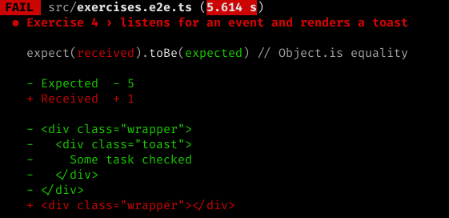

# Exercise 4

In this lesson, we will use the `<todo-notification>` Web Component to handle the `CustomEvent` from lesson 3. Once finished, this component will listen for the `todoItemToggled` event and will display a short notification before disappearing.

We will also cover:

1. Internal State
1. Using `<slot>` to hold child nodes
1. Some implications of the ShadowDOM regarding CSS

## 1. In your console

### Branch checkout

We will be using the branch `ex-4`:

```bash
git checkout -f ex-4
```

### Setting expectations

```bash
yarn test
```

#### Output



The test is expecting an extra DOM node to be rendered to the wrapper after a click, but it isn't there.

### Run command

If your server isn't already started, start it.

```bash
yarn start
```

## 2. In your browser

This should look similar to how Exercise 3 began, except that we now have more `<todo-item>` elements on the page.

## 3. In your editor

1. Open `src/index.html`
1. We still have `<todo-item>`s, but they are children of the `<todo-notification>`

### Modifying the component definition

Here we will make changes to `<todo-notification>`, since we already know that the event is being fired.

1. Open `src/components/todo-notification/todo-notification.tsx`

#### Templating with slots

Before we continue, notice the `<slot></slot>` that's rendered with the rest of the JSX. This is part of the Web Components API and acts as a placeholder for any child content that gets passed in to the element. For example, if we had the following in our `index.html`:

```html
<todo-notification>
  <p>I am slotted content</p>
</todo-notification>
```

That `<p>` will **only** appear if the component definition renders a `<slot>`.

For more information, see [Using templates and slots](https://developer.mozilla.org/en-US/docs/Web/Web_Components/Using_templates_and_slots).

#### Using State

Another important callout in the component definition is the use of the `@State` decorator. Like React, any change to a state variable will trigger a re-render. Here, we are using a stateful array called `toastMessages` to iteratively render content to the DOM. Any time we reassign that array variable, `<todo-notifications>` will re-render.

```jsx
    {this.toastMessages.map( message =>
      <div class="toast">{message}</div>
    )}
```

In our event handler, we will have to modify the `toastMessages` state variable for this to work.

#### Event handling

For simplicity, the `Listen` decorator has already been imported and we have it decorating a handler stub called `handleToggle`. To complete this function, we need to:

1. Get the `name` out of the event detail and reassign a new array variable containing that `name`
1. Have some way of removing the notifications to prevent cluttering the screen
    - `setTimeout()` can be used for this


## Wrapping up

Once the event handler is properly set up, we should see a notification appear when we toggle an item, and disappear after 3 seconds. Once again, let's make sure we've satisfied the tests.

```bash
yarn test
```

