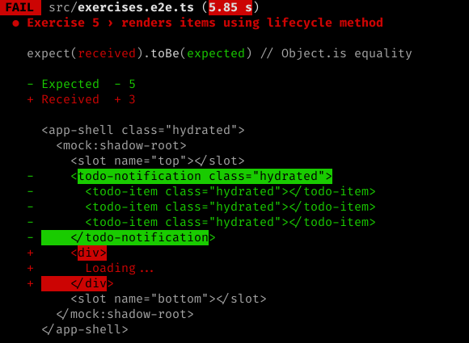

# Exercise 5

Exercise 5 will be the last of the exercises to offer automated tests that we're working to meet. Here we will be using a Web Component lifecycle method, and also diving into `<slot>` a bit more.

## 1. In your console

### Branch checkout

We will be using the branch `ex-5`:

```bash
git checkout -f ex-5
```

### Setting expectations

```bash
yarn test
```

#### Output



The lifecycle method isn't populating our `items` array and isn't changing the `loading` state variable.

### Run command

If your server isn't already started, start it.

```bash
yarn start
```

## 2. In your browser

When you first open the page you will just see **Loading...** towards the center of the page.

## 3. In your editor

1. Open `src/index.html`
1. There is a single Web Component on the page - `<app-shell>`

### Modifying the component definition

1. Open `src/components/app-shell/app-shell.tsx`
1. Notice the stub `connectedCallback()` function
    - This is the lifecycle method that we will be completing.
1. Assign `this.items` to be an array of whatever strings you want (i.e. 'Vacuum the floors').
1. Set `this.loading` to `true`
    - This state change will trigger a re-render

### Using named slots

Our `<app-shell>` component is already rendering named slots for `top` and `bottom`. Like with unnamed slots, these serve as placeholders for any content that a consumer of the component might want to provide. Let's try that out.

1. Open `src/index.html`
1. In `<app-shell>`, add a DOM node with a slot attribute with the appropriate name, like `<span slot="top">I'm at the top</span>`
1. Repeat the previous process for a DOM node for the `bottom` slot.
1. Notice that these new pieces of content appear above and below the `<todo-*>` elements.

Slots, and named slots in particular, provide a powerful way to create components that act as templates.

## Wrapping up

In your browser, you should now see **Loading...** displayed for a few seconds, and then it is replaced by `<todo-item>`s inside a `<todo-notification>`. Our use of the `connectedCallback()` lifecycle method is simulating an initial API call that happens only once - each successive re-render does not call `connectedCallback()` again.

This will be the last automated test, so let's make sure our changes get it to pass.

```bash
yarn test
```

