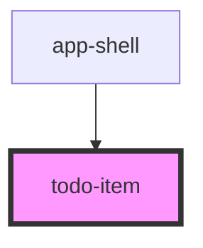

# todo-item

<!-- Auto Generated Below -->

## Properties

| Property | Attribute | Description | Type     | Default     |
| -------- | --------- | ----------- | -------- | ----------- |
| `name`   | `name`    |             | `string` | `undefined` |

## Events

| Event             | Description | Type               |
| ----------------- | ----------- | ------------------ |
| `todoItemToggled` |             | `CustomEvent<any>` |

## Dependencies

### Used by

 - [app-shell](../app-shell)

### Graph

----------------------------------------------

*Built with [StencilJS](https://stenciljs.com/)*
